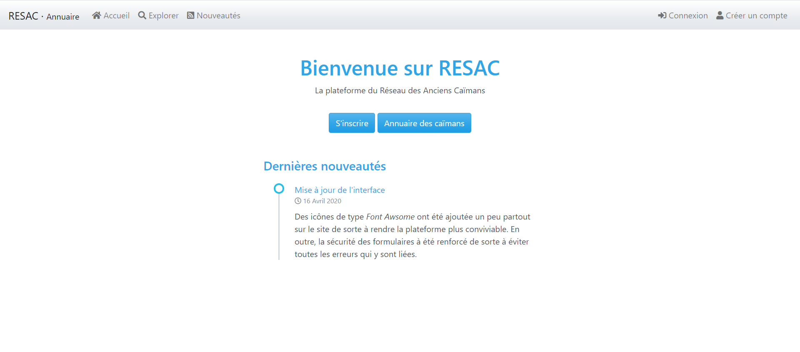

# RESAC

RESAC est la plateforme du réseau des anciens caïmans. Ici, le dépôt offciel du projet actuellement en version 2. La version 2 utilise un Framework built-in offrant les fonctionnalités de base spécifiques à l'application web du projet.

Lien vers le site: [RESAC](https://resac2.herokuapp.com/).

Consulter le fichier **todo.md** pour suivre l'évolution du développement.

## Capture

## Fonctionnalités built-in principales

- **Fil d'actualités (Nouveau)**
- Validateur de formulaire
- Emetteur de notifications
- Raccourcisseur d'url
- Redirecteur

## Mises à jour de la version 2

- src/redirect.php
  - Ajout de la methode route_back()

- config/countries.php
  - Ajout d'un tableau de tous les pays du monde

- src/services/countries/
  - Création des services au travers de l'intégration d'un service pour gérer les pays

- connexion.php
  - Auto redirection avec le formuailre de connexion

- src/utils.php
  -  Ajout de la fonction dump() pour un var_dump avec la fonction pre

- forms/Form.php
  - Intégration des fonctionnalités pour la gestion des erreurs par champs
  - Intégration de la vérifcation automatiquement pour:
    - Le format de l'E-mail
    - L'égalité de deux champ(cas des mots de passe)

- forms/RegisterForm.php
  - Adaptation de la classe à la nouvelle version de la classe Form

- inscription.php
  -  Adaptation du traitement à la nouvelle version de la classe RegisterForm
  - Ajout des erreurs manquantes

- forms/UserForm.php
  - Adaptation de la classe à la nouvelle version de la classe Form
  - Ajout de la méthode Users::email_is_unique($email)
  - Ajout d'un validateur de format d'adresse E-mail
  - Ajout d'un validateur d'égalité de champ

- parametres.php
  - Adaptation de la classe à la nouvelle version de la classe UserForm

- models/Model.php
  - Ajout d'une classe de base pour les modèles

- models/Post.php
  - Ajout d'une classe pour la présentation des publications
