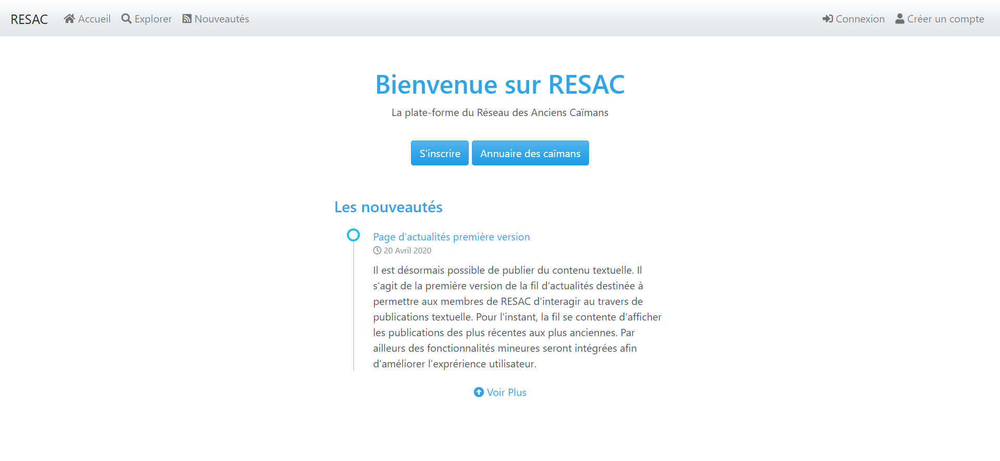

# RESAC

RESAC est la plate-forme du réseau des anciens caïmans. Ici, le dépôt officiel du projet maintenant basé sur **Laravel**. Le projet utilise des fonctionnalités built-in pour assurer des fonctions spécifiques à l'application web du projet.

Lien vers le site: [RESAC](https://resac2.herokuapp.com/).

Consulter le fichier **todo.md** pour suivre l'évolution du développement.

## Capture

## Fonctionnalités

### Récentes
- Moteur de recherche d'utilisateurs (nouveau)
- Gestion des nouveautés

### Anciennes
- Actualités
- Gestion des publications
- Administration

## Fonctionnalités built-in principale

- Validateur de formulaire
- Emetteur de notifications

## Mise à jour de la version 3.2

- Table new_features pour les nouveautés crées avec Laravel
- Table SearchUserIndex, joue le rôle d'index de recherche pour la recherche d'utilisateur

- Mise à jour des clées pour le mise en ligne
  - Supprimer les foreigns
  - Mettre à jour les colunnes foreign en bigint unsigned
  - Récreer tous les foreign
