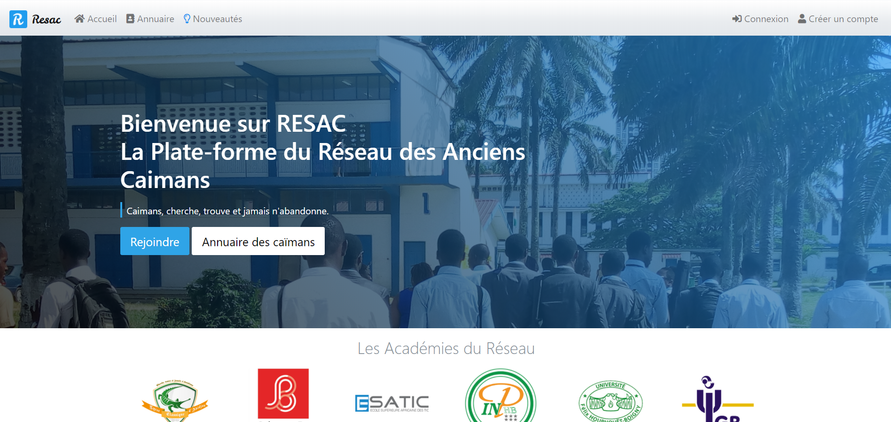

# RESAC

RESAC est la plate-forme du réseau des anciens caïmans. Ici, le dépôt officiel du projet maintenant basé sur **Laravel**. Le projet utilise des fonctionnalités built-in pour assurer des fonctions spécifiques à l'application web du projet.

Lien vers le site: [RESAC](https://resac2.herokuapp.com/).

Consulter le fichier **todo.md** pour suivre l'évolution du développement.

## Capture

## Fonctionnalités

### Récentes
- Administration
- Gestion des publications

### Anciennes
- **Actualités**

## Fonctionnalités built-in principale

- Validateur de formulaire
- Emetteur de notifications

## Mises à jour du Framework built-in (version 3)

- Les fonctionnalités du Framework de base ont été intégré à Laravel comme extension

- Ajout des champs is_staff, staff_role à la table des utilisateurs

- auth, redirect, flash deviennent des services

- Mise de la classe Auth
  - Ajout des méthodes is_admin et role

  - Modification de la table pub_v1
    - Ajout du champ validate
    - Ajout du champ validate_by
    - Ajout du champ validate_at

- Supression en CASCADE sur les publications avec pour référence la table user
